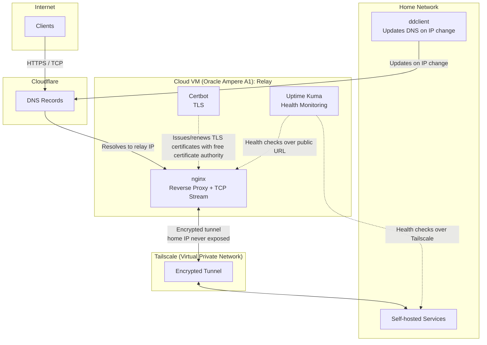

# Homelab Architecture

A self-hosted homelab (on a old Lenovo laptop) exposing services to the internet without paying for a proxying tier that supports non-HTTP traffic and without directly exposing the home network's IP address.

The core problem: Cloudflare's free proxy tier ("orange cloud") only proxies HTTP(S) traffic — it can't front raw TCP services like a Minecraft server. Solving this without paying for a business-tier CDN meant building a lightweight reverse-proxy relay on a free-tier cloud VM instead.

## Architecture

## Design

- **Relay VM (Oracle Cloud Ampere A1):** proxies traffic, and is the only publicly exposed port. Runs nginx for both standard HTTP(S) reverse proxying and raw TCP stream proxying, Certbot for automated TLS issuance, and Uptime Kuma for monitoring.
- **Tailscale mesh:** connects the relay to the home network over an encrypted tunnel, so the home network's real IP is never exposed to the internet — only the relay's IP is public. ACL permissions also managed to restrict the VMs permissions to purely forwarding traffic.
- **Dynamic DNS:** `ddclient` monitors public IP changes and updates DNS records automatically.
- **Certificate management:** TLS certificates are issued via the Let's Encrypt CA.

## Traffic / access model

### Relay VM (public-facing)

|         Service          | Port(s) |                                                       Traffic Accepted                                                       |
| :----------------------: | :-----: | :--------------------------------------------------------------------------------------------------------------------------: |
|    nginx (HTTP/HTTPS)    | 80, 443 | Open to traffic, but nginx `server_name` matching rejects requests for unrecognized hostnames (closed to random IP scanning) |
| nginx (TCP stream relay) |  25565  |                                                     Open to TCP traffic                                                      |
|       Uptime Kuma        |  3001   |                                                     Tailscale peers only                                                     |

### Home network (internal, behind Tailscale)

| Service  |  Port  |   Traffic Accepted   |
| :------: | :----: | :------------------: |
| Services | varies | Tailscale peers only |

## Note

This is a sanitized public mirror of infrastructure I actually run. Non-infrastructure services, hostnames, IP addresses, and credentials have been redacted or replaced with placeholders; the configs included here are representative of the real setup but not a live copy.
